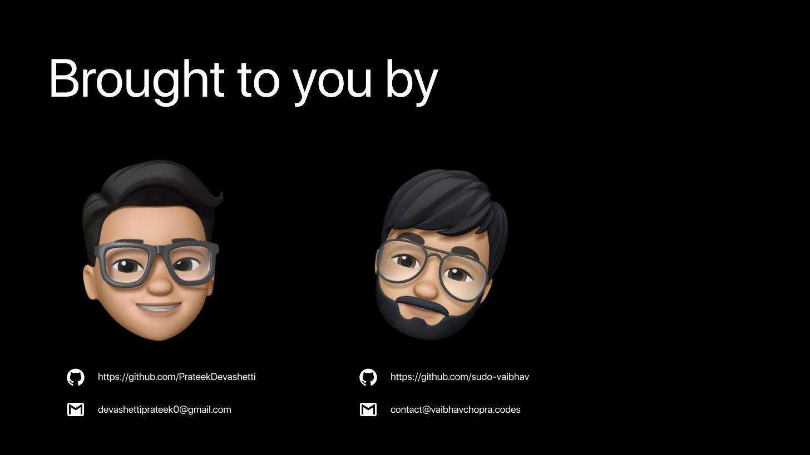

# Smriti
### Table of Contents
* About the Product
	* Built With
	* Research 
  * Statistical analysis
* Business Model
  * Target Audience.
  * Branding
* Video
__________
#### About the Product

_________

#### Built with

____
#### Research

Alzheimer's disease is one of those diseases which hasn’t seen any cure since the past 100 years , scientist havent found a cure till now the only means to do something which will bring a significant change in community is by providing some aid . The main reason people suffer from alzheimer’s disease is that as we grow old the blood flow to our brain is reduced and hence the blood cells do not recieve ample amount of blood and due to this blood cells start decaying and rupturing our brain cells and hence there it affects the folds of our brain and due to that the memory retention capacity is decreased and therefore we might even stop remembering things which we did this morning 

##### Our Source

________
##### Statistical Analysis

* One in 10 people throughout the world will develop dementia at some point in their life
* 6th leading cause of deaths in United States.
* Almost two-thirds of Americans with Alzheimer's are women.
* People in poor communities are twice as likely to develop Alzheimers than their rich counterparts
* It has been known for 110+ years but there is still no cure for it.
* 1 in 3 Seniors dies with Alzheimer’s or another dementia. It kills more than Breast Cancer and Prostrate cancer combined.
* These caregivers provided an estimated 18.6 Billion hours of care valued at nearly $244 Billion Worldwide. For comparison, the Indian domestic pharmaceutical industry is worth 	approximately $20 Billion in 2020
* A new case is diagnosed every 70 seconds

________
#### Business model

As the alzheimer’s disease is one of those diseases where more than $ 244 billion is spent every year for talking care of theese patients and the amount of time spent is 18.6 billion hrs which is more than the gdp of our country and the fact that providing aid to such a multi billion dollar industry  would not only benefit it the customers but even would help us produce a large amount of cash flow which can be actually implemented for further goals and this might sound very fancy and inspiring but there is something which will actually blow your mind cause you might think that buying such a product will be too expensive but trust us when we say that the actuall cost for building the product is as low as $ 30 to $ 50 and as an extra passive income our idea is to have ola or uber as our affiliated partner , so everytime someone books a cab from our app,we get affiliated money from our partner.This not only gives us a passive income but also helps our customer to stand on his own feet   

_________

#### Target Audience
* Women.
* People in poor communities 
* Majority of the audience are senior citizens ,and with getting old comes eye issues there for our main focus are the senior citizens
* or any person suffering from alzheimer’s disease
________

#### Link for Raspberry pie typescript API
[Click here to view the API](https://github.com/sudo-vaibhav/smriti-rpi-api)
________
#### Video Submission

Here is a video about our product. Please click on the image to view the video.

______

### Creators

